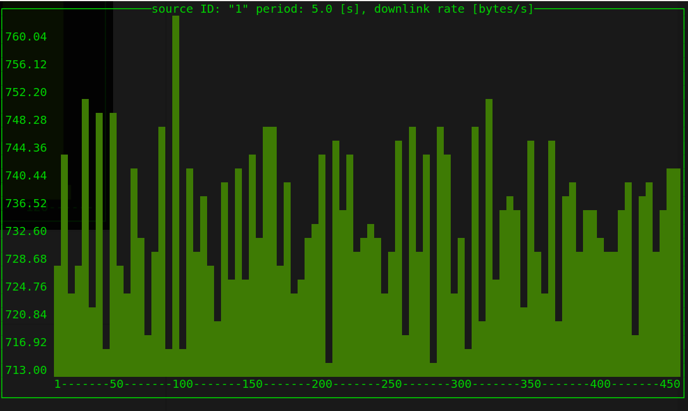
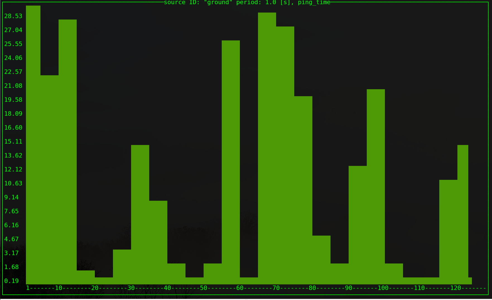

# haskell-plotter
Simple terminal application based on Brick, plots Pprzlink message data from Ivy bus.



# Installation
1. you need to install GHC and Cabal
2. run with `cabal new-run haskell-plotter -- $SOME_ARGUMENTS`


# Usage

```
Haskell Ivy plotter

Usage: haskell-plotter (-m|--message MESSAGE) (-n|--name NAME) [-p|--period T]
                       [-i|--field INDEX]
  Plots data from Ivy bus in terminal. For example: brick-devlunch -m
  TELEMETRY_STATUS -n ping_time -p 1.0 -i 11

Available options:
  -m,--message MESSAGE     Pprzlink message name
  -n,--name NAME           Display name of the variable
  -p,--period T            Refresh period in seconds
  -i,--field INDEX         Index of the variable in a given message
  -h,--help                Show this help text
```

# Example
In this example, we want to show the `ping time` from the `TELEMETRY_STATUS` message. The message on Ivy bus looks like this:
```
ground TELEMETRY_STATUS 1 -1 0.019837 3979054 142328 705.0 1671 2 1669 0 716 25.77'
```

1. Look at Pprzlink's [messages.xml](https://github.com/paparazzi/pprzlink/blob/master/message_definitions/v1.0/messages.xml) and find `TELEMETRY_STATUS`:
```xml
    <message name="TELEMETRY_STATUS" id="32">
      <description>
        Datalink status reported by Server for the GCS
        Combines DATLINK_REPORT (telemetry class) and LINK_REPORT (ground class)
      </description>
      <field name="ac_id" type="string"/>
      <field name="link_id" type="string"/>
      <field name="time_since_last_msg" type="float" unit="s"/>
      <field name="rx_bytes" type="uint32"/>
      <field name="rx_msgs" type="uint32"/>
      <field name="rx_bytes_rate" type="float" format="%.1f" unit="bytes/s"/>
      <field name="tx_msgs" type="uint32"/>
      <field name="uplink_lost_time" type="uint32" unit="s"/>
      <field name="uplink_msgs" type="uint16"/>
      <field name="downlink_msgs" type="uint16"/>
      <field name="downlink_rate" type="uint16" unit="bytes/s"/>
      <field name="ping_time" type="float" format="%.2f" unit="ms"/>
</message>
```

2. The message name is `TELEMETRY_STATUS`.
3. Now we need to find the index of `ping_time`. Counting from top, we know that is is the 11-th field (we use 0-indexing).
Hence `-i 11`
4. Name of the variable is `ping_time`, hence `-n "ping time"`
5. Optionally we can specify the update period in seconds (default is 1.0 s): `-t 5`
6. Putting it all togerther we have: 
```
$ cabal new-run haskell-plotter -- -r "(.*) TELEMETRY_STATUS (.*)" -n "ping time" -t 5.0 -i 11
```
7. And voila, here is the output:



